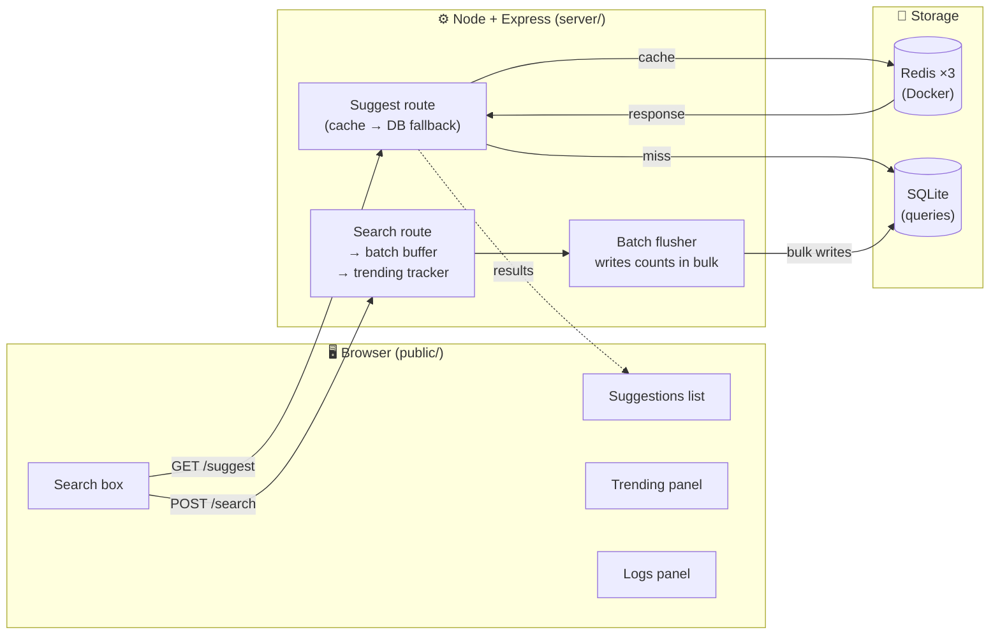

# .✦ ݁˖ Lil Search .✦ ݁˖

A search-as-you-type suggestion system (like the dropdown under a search engine's
search box). It serves the top 10 popular queries that start with what you're typing,
records the searches you submit, and keeps suggestions fast using a **distributed Redis
cache** routed by **consistent hashing**. It also supports **trending** (recency-aware)
ranking and **batch writes** to reduce database load.


---

##  Quick Start 

The only requirement is **Docker Desktop** (running). Then, from the project folder:

```bash
docker compose up --build
```

That one command builds the app, **downloads the dataset, builds the database, and
starts the app plus all 3 Redis cache nodes**. When you see `started url=...`, open:

###  **<http://localhost:3000>**

Stop everything with `Ctrl+C` (or `docker compose down`). No Node.js install, no manual
dataset download, no extra steps. *(First build takes ~1–2 minutes.)*

---

##  Architecture (one-minute version)



- **SQLite** is the *primary data store* (the source of truth for query counts).
- **Redis ×3** is the *cache* (fast, temporary copies of suggestion results).
- **Consistent hashing** (our code) decides which Redis node owns each prefix.

---

## How to Run It

You need **Docker Desktop** installed (Node.js too, only for Option B).

### Option A — One command (everything in Docker) ✅ easiest

This builds the app image (which downloads the dataset and builds the database
inside the image) and starts the app **plus** the 3 Redis cache nodes together:

```bash
docker compose up --build
```

Then open <http://localhost:3000>. Stop it with `Ctrl+C`, or `docker compose down`.

>  The app talks to Redis over the Compose network using the service names
> `redis-0/redis-1/redis-2`; locally it uses `localhost`. This is controlled by the
> `REDIS_NODES` environment variable (set for you in `docker-compose.yml`).

### Option B — Local dev (edit & re-run the app without rebuilding)

Run only Redis in Docker and the app on your machine:

```bash
# 1. Start just the 3 Redis cache nodes
docker compose up -d redis-0 redis-1 redis-2

# 2. Install dependencies
npm install

# 3. Download + load the dataset into SQLite (see "Dataset" below)
npm run load

# 4. Start the server, then open http://localhost:3000
npm start
```

To measure performance (with the server running, in another terminal):

```bash
npm run bench
```

###  Sharing the image

The app image is self-contained, so you can publish it for others to pull:

```bash
docker compose build app
docker tag typeaheadsystem-app <your-dockerhub-user>/typeahead-app:latest
docker push <your-dockerhub-user>/typeahead-app:latest
```

> **Note:** Redis is **not** inside the app image — it runs as separate official
> `redis:7-alpine` containers (one process per container is best practice). The
> consistent-hashing router that decides which node owns each key is **our** code.

---

##  Using the UI (what each part is)

| Part | What it does |
|------|---------------|
| **Search box** | Type a prefix (e.g. `ip`, `java`). Suggestions appear instantly, ranked by all-time popularity blended with recent activity. Use ↑/↓ to highlight, Enter to search, or click a suggestion. |
| **Cache HIT/MISS indicator** | Under the box, a live line shows whether the lookup was answered from Redis (HIT) or the database (MISS), which Redis node served it, and how long it took. This is the distributed cache working, made visible. |
| **Trending now** | Queries getting popular recently; they rise on activity and fade via decay. |
| **Server activity log** | A live feed of `SUGGEST`, `SEARCH`, `BATCH`, and `DECAY` events, with a legend explaining each. This is the evidence the system behaves as designed. |

## Screenshots

### 1. Home Interface

The landing page of Lil Search showing the search box, trending section, and live activity log.


---

### 2. Typeahead Suggestions

Real-time autocomplete suggestions appear as the user types. Results are ranked using a combination of all-time popularity and recent activity scores.


---

### 3. Search Submission & Trending Updates

After a query is searched, it is added to the recent-activity tracker and immediately reflected in the Trending section.


---

### 4. Recency-Aware Ranking

Recent searches receive a temporary ranking boost. In this example, **java** rises above older queries due to recent search activity.


---

### 5. Live System Activity

The activity log displays internal system events including cache hits/misses, Redis node routing, batch writes, and score decay operations.


## 📊 Dataset

This project uses the open **English Word Frequency** list — the Google Web Trillion
Word Corpus, published by Peter Norvig. It contains **333,333 rows**, each a word and its
real-world frequency (`word <TAB> count`). That already matches the required
`query | count` format and far exceeds the 100,000-row minimum, so **no count derivation
is needed** — we use the published frequency directly as the popularity count.

- **Source:** <https://norvig.com/ngrams/count_1w.txt> (free, no login)
- Same data is also on Kaggle as *English Word Frequency* (`unigram_freq.csv`).

Download it into the `data/` folder, then load it:

```bash
# download (no login required)
curl -L -o data/count_1w.txt https://norvig.com/ngrams/count_1w.txt

# load into SQLite (creates data/queries.db)
npm run load
```

The loader (`data/load_data.js`) creates the `queries` table, then bulk-inserts all rows
in a single transaction (~3–4 seconds).

---

## 📡 API Documentation

| Method | Endpoint | What it does |
|--------|----------|--------------|
| `GET` | `/suggest?q=<prefix>` | Up to 10 suggestions starting with `<prefix>`, best first |
| `POST` | `/search` | Records a submitted query; returns `{"message":"Searched"}` |
| `GET` | `/cache/debug?prefix=<prefix>` | Shows which Redis node owns the prefix + hit/miss |
| `GET` | `/trending` | Top queries by recent activity |
| `GET` | `/stats` | Batch-write evidence: searches received vs DB rows written |
| `POST` | `/flush` | Force the batch buffer to flush now (the page calls this on reload) |
| `GET` | `/logs?n=50` | Most recent log lines (also shown in the UI) |

<details>
<summary><strong>Example — <code>GET /suggest</code></strong></summary>

```bash
curl "http://localhost:3000/suggest?q=ip"
```
```json
{
  "q": "ip",
  "count": 10,
  "suggestions": [
    { "query": "ip",   "count": 64162886 },
    { "query": "ipod", "count": 36985229 },
    { "query": "ipaq", "count": 7454622 }
  ]
}
```

Input is case-insensitive (`IP` == `ip`); empty, missing, or no-match input returns
`{"count": 0, "suggestions": []}` instead of an error.

</details>

<details>
<summary><strong>Example — <code>POST /search</code></strong></summary>

```bash
curl -X POST http://localhost:3000/search \
  -H "Content-Type: application/json" \
  -d '{"query":"iphone"}'
```
```json
{ "message": "Searched" }
```

This records the query (new query → count 1; existing query → count + 1).

</details>

<details>
<summary><strong>Example — <code>GET /cache/debug</code></strong></summary>

```bash
curl "http://localhost:3000/cache/debug?prefix=ip"
```
```json
{ "prefix": "ip", "key": "sugg:ip", "node": "redis-2", "hit": true }
```

`node` is the Redis node our consistent-hashing ring assigns to that prefix; `hit` says
whether a value is currently cached there. You can confirm the placement directly:

```bash
docker exec typeahead-redis-2 redis-cli keys 'sugg:*'
```

`/suggest` responses also include `"cache": "HIT"|"MISS"` and the owning `"node"`.

</details>

<details>
<summary><strong>Example — <code>GET /trending</code></strong></summary>

```bash
curl "http://localhost:3000/trending?n=5"
```
```json
{ "trending": [ { "query": "pizzo", "recent": 3, "count": 78549 } ] }
```

**Basic vs. recency-aware ranking (live demo).** For prefix `piz`, `pizzo` ranks #9 by
all-time count. After searching it 3 times, recency lifts it to #1:

```
BASIC (by count)         ENHANCED (count + recency)
1. pizza   14,763,787    1. pizzo   (recent=3)   ← jumped from #9
2. pizzeria   923,597    2. pizza   (recent=0.6) ← spike decaying
...                      ...
```

Recent scores **decay** (×0.5 every 30s), so a short-lived spike fades back down on its own.

</details>

<details>
<summary><strong>Example — <code>GET /stats</code></strong> (batch-write evidence)</summary>

```bash
curl "http://localhost:3000/stats"
```
```json
{
  "received": 60,
  "rowsWritten": 4,
  "flushes": 2,
  "lastFlush": { "reason": "timer", "searches": 29, "rows": 2, "invalidated": 12 },
  "buffered": 0,
  "reductionPct": 93
}
```

60 searches became only 4 database row-writes — a **93% write reduction**. Searches are
buffered in memory and aggregated; the buffer is flushed in one transaction when the
**earliest** of these happens: the **page is reloaded** (`POST /flush`), a **30-second
timeout** elapses, or the buffer reaches **200 distinct queries**. Each flush also
invalidates the affected prefix caches so suggestions stay fresh.

</details>

---

## 📈 Performance Report

Measured with `npm run bench` (200 searches + 3,000 suggestion requests) against the
running server on the full 333,333-row dataset:

| Metric | Result |
|--------|--------|
| Suggest latency — mean | 4.5 ms |
| Suggest latency — p50 | 3.8 ms |
| **Suggest latency — p95** | **6.3 ms** |
| Suggest latency — p99 | 28.8 ms |
| **Cache hit rate** | **99.0%** (2,970 hits / 30 misses) |
| DB reads (= cache misses) | 30 — exactly one cold miss per distinct prefix |
| **Batch write reduction** | **96%** (200 searches → 8 row-writes) |

**How to read this:** the 30 misses are precisely the 30 distinct prefixes the benchmark
uses — the *first* request for each prefix is a miss (served from SQLite and then cached),
and every repeat is a hit. That's the cache-aside pattern working as intended. The 96%
write reduction shows batching turning 200 searches into 8 transactions.

> ℹ Numbers vary by machine; the benchmark prints fresh values each run. Latency includes the
> local HTTP round-trip, so server-side work is even smaller (the logs show 1–4 ms).

---

##  Design Choices & Trade-offs (summary)

| Decision | Why | Trade-off |
|----------|-----|-----------|
| **SQLite** as primary store | Single file, zero setup, plenty fast for 333k rows | Not for huge multi-server scale (fine here) |
| **Indexed range scan** for prefix search (`query >= 'ip' AND query < 'iq'`) | Always uses the index → ~1–4 ms even on 333k rows | Slightly less obvious than `LIKE 'ip%'` |
| **Real Redis ×3** + **own consistent-hashing ring** | The assignment wants a *distributed* cache; the routing code is the gradeable concept, provable with `redis-cli` | Needs Docker running |
| **Consistent hashing** (not `hash % 3`) | Adding/removing a node moves only one arc of keys, not the whole cache | A bit more code (the hash ring) |
| **Cache the candidate pool, not the final order** | Reads stay fast *and* trending stays live (recency blended in per-request) | Tiny re-rank cost on each request |
| **Recency in memory + decay** | Instant, always-fresh, and adds **zero** DB writes | Resets on restart (acceptable for a demo) |
| **Batch writes** (buffer → aggregate → one transaction) | 96% fewer DB writes; `/search` returns instantly | A crash between flushes loses buffered counts |

See [`PROCESS.md`](./PROCESS.md) for the full, step-by-step reasoning behind every part
of this system .

## Future Improvements

* Multi-word query support
* Query typo correction
* Search analytics dashboard
* Redis cluster deployment
* Rate limiting
* User search history
* Search personalization
* Prefix trie indexing
* Monitoring and metrics dashboard

## ⭑ Creator ⭑

**Ankita Tripathi**

Built as a distributed systems and search infrastructure project to explore how modern autocomplete engines combine databases, caching layers, ranking systems, and scalable architectures to deliver low-latency search experiences.